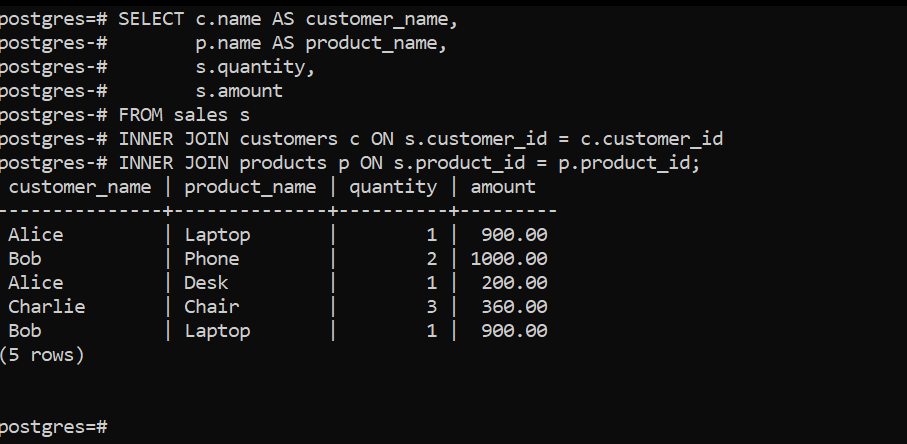
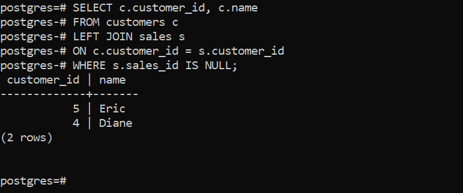
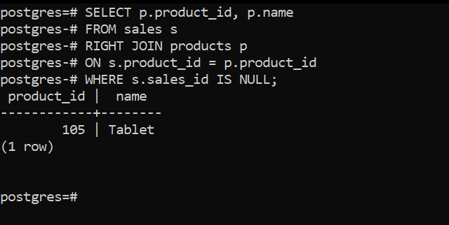
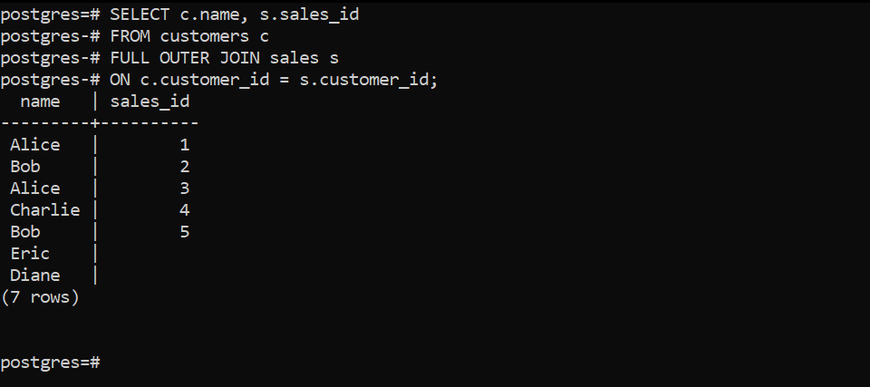
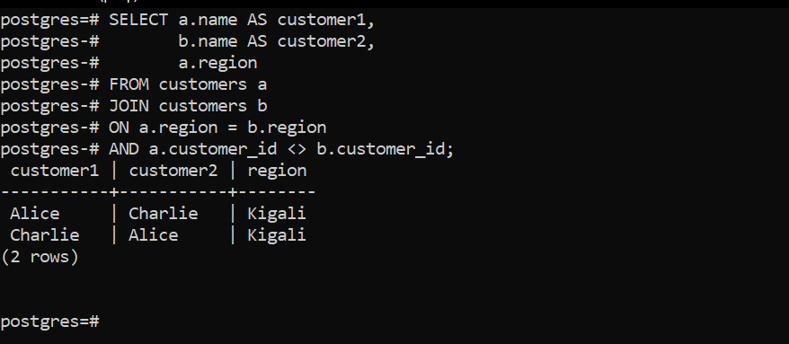
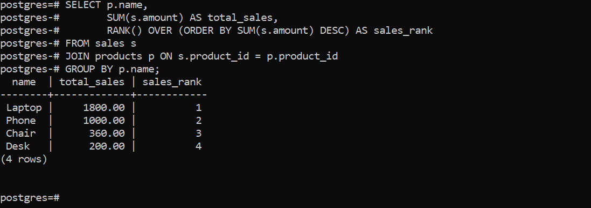
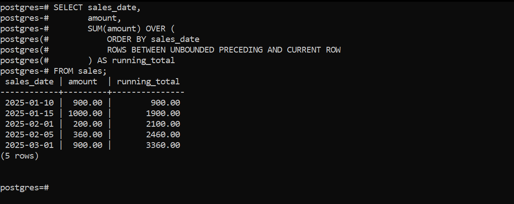
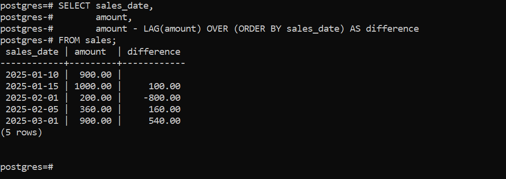
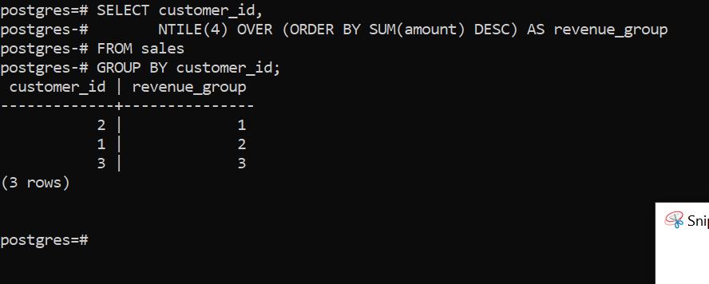

# SQL JOINs & Window Functions Project
BEGIN
    DBMS_OUTPUT.PUT_LINE('Course: INSY 8311 Database Development with PL/SQL' || CHR(10) ||
                         'Student: Kajyojyi ntwari David' || CHR(10) ||
                         'Group A' || CHR(10) ||
                         'Instructor: Eric Maniraguha');
END;
/


## 1. Problem Definition

### Business Context
This project is based on a small retail business that sells products to customers in different regions. The company stores customer, product, and sales transaction data in a database.

### Data Challenge
Although sales data is recorded daily, management does not have clear reports showing which products sell the most or which customers contribute the most revenue. It is also difficult to track how sales change over time.

### Expected Outcome
The analysis should help identify top selling products, understand customer purchasing behavior, and track sales trends to support better business decisions.


## 2. Success Criteria

1. Identify top-selling products using **RANK()**
2. Calculate cumulative sales totals using **SUM() OVER()**
3. Analyze sales changes between transactions using **LAG()**
4. Segment customers into revenue groups using **NTILE(4)**
5. Calculate moving average sales using **AVG() OVER()**


---

## 3. Database Schema Design

For this project, I designed a relational database made up of three related tables: **customers**, **products**, and **sales**. The **customers** table stores customer information such as name and region, while the **products** table stores product details like category and price. The **sales** table records transactions and connects customers with the products they purchase.

Each table contains a **primary key** to uniquely identify records. The **sales** table includes **foreign keys** (`customer_id` and `product_id`) that reference the **customers** and **products** tables. These relationships ensure data integrity and allow the use of SQL JOIN operations for analysis. The schema structure supports reporting, sales tracking, and window function queries used in this project.


---

## 4. Entity Relationship Diagram (ERD)


---

## 5. Part A - SQL JOINs

### INNER JOIN
```sql
SELECT c.name, p.name, s.amount
FROM sales s
INNER JOIN customers c ON s.customer_id = c.customer_id
INNER JOIN products p ON s.product_id = p.product_id;
```

### inner join screenshot


---

### LEFT JOIN
```sql
SELECT c.customer_id, c.name
FROM customers c
LEFT JOIN sales s ON c.customer_id = s.customer_id
WHERE s.sales_id IS NULL;
```

### left join screenshot


---

### RIGHT JOIN
```sql
SELECT p.product_id, p.name
FROM sales s
RIGHT JOIN products p ON s.product_id = p.product_id
WHERE s.sales_id IS NULL;
```

### right join screenshot


---

### FULL OUTER JOIN
```sql
SELECT c.name, s.sales_id
FROM customers c
FULL OUTER JOIN sales s
ON c.customer_id = s.customer_id;
```

### full outer screenshot


---

### SELF JOIN
```sql
SELECT a.name, b.name, a.region
FROM customers a
JOIN customers b
ON a.region = b.region
AND a.customer_id <> b.customer_id;
```

### self join screenshot


---

## 6. Part B - Window Functions

### Ranking Function
```sql
SELECT p.name,
       SUM(s.amount) AS total_sales,
       RANK() OVER (ORDER BY SUM(s.amount) DESC) AS rank
FROM sales s
JOIN products p ON s.product_id = p.product_id
GROUP BY p.name;
```

### ranking function screenshot


---

### Aggregate Function
```sql
SELECT sales_date,
       amount,
       SUM(amount) OVER (ORDER BY sales_date) AS running_total
FROM sales;
```

### aggregate function screenshot


---

### Navigation Function
```sql
SELECT sales_date,
       amount,
       amount - LAG(amount) OVER (ORDER BY sales_date) AS difference
FROM sales;
```

### navigation function screenshot


---

### Distribution Function
```sql
SELECT customer_id,
       NTILE(4) OVER (ORDER BY SUM(amount) DESC) AS quartile
FROM sales
GROUP BY customer_id;
```

### distribution screenshot


---
### Moving Average (AVG OVER)
```sql
SELECT sales_date,
       amount,
       AVG(amount) OVER (
           ORDER BY sales_date
           ROWS BETWEEN 2 PRECEDING AND CURRENT ROW
       ) AS moving_average
FROM sales;
```
### Moving Average screenshot


## Results Analysis

### Descriptive
Sales records show that revenue is not evenly distributed across all products and customers. A few products generate most of the sales, and some customers purchase more frequently than others.

### Diagnostic
This pattern occurs because certain products are consistently purchased across multiple regions, and a small group of loyal customers contributes significantly to total sales revenue.

### Prescriptive
The business should prioritize stocking and promoting high  performing products, build loyalty programs for repeat customers, and review pricing or promotion strategies for low selling products.

---

## References
PostgreSQL Official Documentation  
SQL Window Functions Documentation  

---

## Integrity Statement
All sources were properly cited. Implementations and analysis represent original work. No AI generated content was copied without attribution or adaptation.
